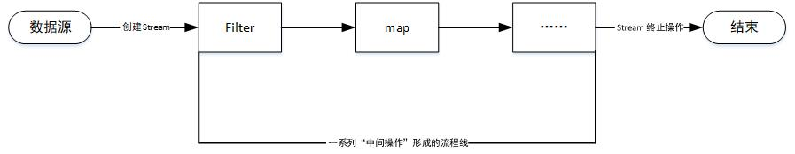
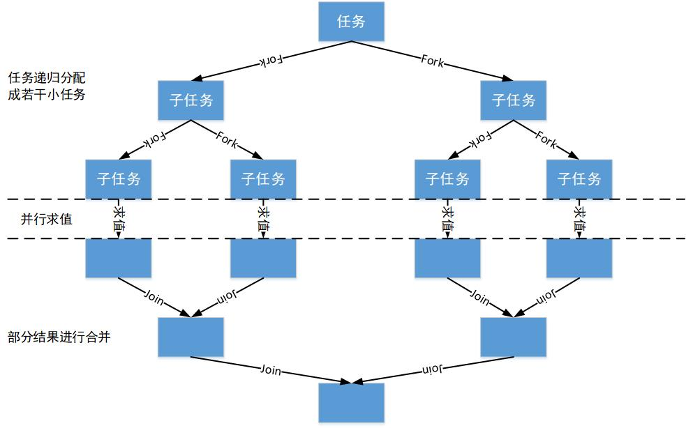

# Stream API

### 一 了解 Stream API

Java 8 中有两个最为重要的该表。第一个是 Lambda 表达式，另一个是 Stream API（java.util.stream.*）

Stream 是 Java 8 中处理集合的关键抽象概念，它可以指定你希望对集合进行的操作，可以执行非常复杂的查找、过滤和映射数据等操作。使用 Stream API 对集合数据进行操作，就类似于使用 SQL 执行的数据库查询。也可以使用 Stream API 来并行执行操作。简而言之，Stream 提供了一种高效且易于使用的处理数据的方式。

**流（Stream）到底是什么呢？**

是数据渠道，用于操作数据源（集合、数组等）所生成的元素序列。**集合关注的是数据，流关注的是计算**

* Stream 不存储元素
* Stream 不会改变源对象。会返回一个持有结果的新 Stream
* Stream 操作时延迟执行的。这意味着他们会等到需要结果的时候才执行

### 二 Stream 操作的三个步骤

#### 1 Stream 的创建 

根据数据源（集合，数组）获取一个流

**根据集合创建流**

Java 8 中 Collection 接口进行了扩展，提供了两个获取流的方法：

* default Stream<E> stream();

  返回一个顺序流

* default Stream<E> parallelStream()

  返回一个并行流

**根据数组创建流**

Java 8 中的 Arrays 的静态方法 stream() 可以获取数组流

* static <T> Stream<T> stream(T[] array)

重载形式，能够获取对应基本类型的数组

* public static IntStream stream(int[] array);
* public static LongStream stream(long[] array);
* public static DoubleStream stream(double[] array);

**根据值创建流**

可以使用静态方法 Stream.of()，通过显示值创建一个流，它可以解后任意数量的参数

* public static<T> Stream<T> of(T... values)

**根据函数创建流：创建无限流**

可以使用静态方位 Stream.iterate() 和 Stream.generate()，创建无限流

* 迭代

  public static<T> Stream<T> iterate(final T seed,final UnaryOperator<T> f)

* 生成

  public static<T> Stream<T> generate(Supplier<T> s)

#### 2 Stream 的中间操作

一个中间操作链，对数据源的数据进行处理

多个**中间操作**可以连接起来形成一个**流水线**，除非流水线上触发终止操作，否则**中间操作不会执行任何的处理**，而是在**终止操作时一次性全部处理，称为“惰性求值”**

**筛选与切片**

| 方法                | 描述                                                         |
| ------------------- | ------------------------------------------------------------ |
| filter(Predicate p) | 接收 Lambda 表达式，从流中排除某些元素                       |
| distinct()          | 筛选，通过流所生成元素的 hashCode() 和 equals() 方法去除重复元素 |
| limit(long maxSize) | 截断流，使其元素不超过给定数量                               |
| skip(long n)        | 跳过元素，返回一个去除前 n 个元素的流。若流中元素不足 n 个，则返回一个空流， 与 limit 互补 |

**映射**

| 方法                            | 描述                                                         |
| ------------------------------- | ------------------------------------------------------------ |
| map(Function f)                 | 接收一个函数作为参数，该函数会被应用到每个元素上，并将其映射成一个新的元素。 |
| mapToInt(ToIntFunction f)       | 接收一个函数作为参数，该函数会被应用到每个元素上，产生一个新的 IntStream。 |
| mapToLong(ToLongFunction f)     | 接收一个函数作为参数，该函数会被应用到每个元素上，产生一个新的 LongStream。 |
| mapToDouble(ToDoubleFunction f) | 接收一个函数作为参数，该函数会被应用到每个元素上，产生一个新的 DoubleStream。 |
| flatMap(Function f)             | 接收一个函数作为参数，将流中的每个值都换成另一个流，然后把所有流连接成一个流 |

**排序**

| 方法                    | 描述                               |
| ----------------------- | ---------------------------------- |
| sorted()                | 产生一个新流，其中按自然顺序排序   |
| sorted(Comparator comp) | 产生一个新流，其中按比较器顺序排序 |

#### 3 Stream 的终止操作

一个终止操作，执行中间操作链，并产生结果

终端操作会从流的流水线生成结果。其结果可以是任何不是流的值，例如：List、Integer，甚至是 void 。

**查找与匹配**

| 方法                   | 描述                                                         |
| ---------------------- | ------------------------------------------------------------ |
| allMatch(Predicate p)  | 检查是否匹配所有元素                                         |
| anyMatch(Predicate p)  | 检查是否至少匹配一个元素                                     |
| noneMatch(Predicate p) | 检查是否没有匹配所有元素                                     |
| findFirst()            | 返回第一个元素                                               |
| findAny()              | 返回当前流中的任意元素                                       |
| count()                | 返回流中元素总数                                             |
| max(Comparator c)      | 返回流中最大值                                               |
| min(Comparator c)      | 返回流中最小值                                               |
| forEach(Consumer c)    | 内部迭代(使用 Collection 接口需要用户去做迭代，称为外部迭代。 相反，Stream API 使用内部迭代——它帮你把迭代做了) |
**归约**

| 方法                             | 描述                                                  |
| -------------------------------- | ----------------------------------------------------- |
| reduce(T iden, BinaryOperator b) | 可以将流中元素反复结合起来，得到一个值。返回 T        |
| reduce(BinaryOperator b)         | 可以将流中元素反复结合起来，得到一个值。返回 Optional |

备注：map 和 reduce 的连接通常称为 map-reduce 模式，因 Google 用它来进行网络搜索而出名。

**收集**

| 方法                 | 描述                                                         |
| -------------------- | ------------------------------------------------------------ |
| collect(Collector c) | 将流转换为其他形式。接收一个 Collector接口的实现，用于给Stream中元素做汇总的方法 |

Collector 接口中方法的实现决定了如何对流执行收集操作(如收集到 List、Set、Map)。但是 Collectors 实用类提供了很多静态方法，可以方便地创建常见收集器实例，具体方法与实例如下表：

| 方法              | 返回类型             | 作用                                                         | 示例                                                         |      |
| ----------------- | -------------------- | ------------------------------------------------------------ | ------------------------------------------------------------ | ---- |
| toList            | List<T>              | 把流中元素收集到List                                         | List emps = list.stream().collect( &nbsp;&nbsp;&nbsp;&nbsp;Collectors.toList() ); |      |
| toSet             | Set<T>               | 把流中元素收集到Set                                          | Set emps = list.stream().collect(  &nbsp;&nbsp;&nbsp;&nbsp;Collectors.toSet() ); |      |
| toCollection      | Collection<T>        | 把流中元素收集到创建的集合                                   | Collectionemps = list.stream().collect( &nbsp;&nbsp;&nbsp;&nbsp;Collectors.toCollection(   &nbsp;&nbsp;&nbsp;&nbsp;&nbsp;&nbsp;&nbsp;&nbsp;ArrayList::new &nbsp;&nbsp;&nbsp;&nbsp;) ); |      |
| counting          | Long                 | 计算流中元素的个数                                           | long count = list.stream().collect( &nbsp;&nbsp;&nbsp;&nbsp;Collectors.counting() ); |      |
| summingInt        | Integer              | 对流中元素的整数属性求和                                     | inttotal = list.stream().collect( &nbsp;&nbsp;&nbsp;&nbsp;Collectors.summingInt(  &nbsp;&nbsp;&nbsp;&nbsp;&nbsp;&nbsp;&nbsp;&nbsp;Employee::getSalary &nbsp;&nbsp;&nbsp;&nbsp;) ); |      |
| averagingInt      | Double               | 计算流中元素Integer属性的平均值                              | doubleavg = list.stream().collect( &nbsp;&nbsp;&nbsp;&nbsp;Collectors.averagingInt( &nbsp;&nbsp;&nbsp;&nbsp;&nbsp;&nbsp;&nbsp;&nbsp;Employee::getSalary &nbsp;&nbsp;&nbsp;&nbsp;) ); |      |
| summarizingInt    | IntSummaryStatistics | 收集流中Integer属性的统计值。如：平均值                      | IntSummaryStatisticsiss = list.stream().collect( &nbsp;&nbsp;&nbsp;&nbsp;Collectors.summarizingInt( &nbsp;&nbsp;&nbsp;&nbsp;&nbsp;&nbsp;&nbsp;&nbsp;Employee::getSalary &nbsp;&nbsp;&nbsp;&nbsp;) ); |      |
| joining           | String               | 连接流中每个字符串                                           | String str = list.stream().map(Employee::getName).collect( &nbsp;&nbsp;&nbsp;&nbsp;Collectors.joining() ); |      |
| maxBy             | Optional<T>          | 根据比较器选择最大值                                         | Optionalmax = list.stream().collect( &nbsp;&nbsp;&nbsp;&nbsp;Collectors.maxBy( &nbsp;&nbsp;&nbsp;&nbsp;&nbsp;&nbsp;&nbsp;&nbsp;comparingInt(Employee::getSalary) &nbsp;&nbsp;&nbsp;&nbsp;) ); |      |
| minBy             | Optional<T>          | 根据比较器选择最小值                                         | Optional min = list.stream().collect( &nbsp;&nbsp;&nbsp;&nbsp;Collectors.minBy(   &nbsp;&nbsp;&nbsp;&nbsp;&nbsp;&nbsp;&nbsp;&nbsp;comparingInt(Employee::getSalary) &nbsp;&nbsp;&nbsp;&nbsp;) ); |      |
| reducing          | 归约产生的类型       | 从一个作为累加器的初始值开始，利用BinaryOperator与流中元素逐个结合，从而归约成单个值 | inttotal = list.stream().collect( &nbsp;&nbsp;&nbsp;&nbsp;Collectors.reducing( &nbsp;&nbsp;&nbsp;&nbsp;&nbsp;&nbsp;&nbsp;&nbsp;0, Employee::getSalar, Integer::sum &nbsp;&nbsp;&nbsp;&nbsp;) ); |      |
| collectingAndThen | 转换函数返回的类型   | 包裹另一个收集器，对其结果转换函数                           | inthow = list.stream().collect( &nbsp;&nbsp;&nbsp;&nbsp;Collectors.collectingAndThen( &nbsp;&nbsp;&nbsp;&nbsp;&nbsp;&nbsp;&nbsp;&nbsp;Collectors.toList(), List::size &nbsp;&nbsp;&nbsp;&nbsp;) ); |      |
| groupingBy        | Map<K,List<T>>       | 根据某属性值对流分组，属性为K，结果为V                       | Map> map = list.stream().collect( &nbsp;&nbsp;&nbsp;&nbsp;Collectors.groupingBy( &nbsp;&nbsp;&nbsp;&nbsp;&nbsp;&nbsp;&nbsp;&nbsp;Employee::getStatus &nbsp;&nbsp;&nbsp;&nbsp;) ); |      |
| partitioningBy    | Map<Boolean,List<T>> | 根据true或false进行分区                                      | Map>vd = list.stream().collect( &nbsp;&nbsp;&nbsp;&nbsp;Collectors.partitioningBy( &nbsp;&nbsp;&nbsp;&nbsp;&nbsp;&nbsp;&nbsp;&nbsp;Employee::getManage &nbsp;&nbsp;&nbsp;&nbsp;) ); |      |

### 三 并行流与串行流

并行流就是把一个内容分成多个数据块，并用不同的线程分别处理每个数据块的流。

Java 8 中将并行进行了优化，我们可以很容易的对数据进行并行操作。Stream API 可以声明性地通过 parallel() 与 sequential() 在并行流与顺序流之间进行切换。

### 四 Fork/Join 框架

**Fork/Join 框架**：就是在必要的情况下，将一个大任务，进行拆分(fork)成若干个小任务（拆到不可再拆时），再将一个个的小任务运算的结果进行 join 汇总.

采用 “工作窃取”模式（work-stealing）：当执行新的任务时它可以将其拆分分成更小的任务执行，并将小任务加到线程队列中，然后再从一个随机线程的队列中偷一个并把它放在自己的队列中。

相对于一般的线程池实现,fork/join框架的优势体现在对其中包含的任务的处理方式上.在一般的线程池中,如果一个线程正在执行的任务由于某些原因无法继续运行,那么该线程会处于等待状态.而在fork/join框架实现中,如果某个子问题由于等待另外一个子问题的完成而无法继续运行.那么处理该子问题的线程会主动寻找其他尚未运行的子问题来执行.这种方式减少了线程的等待时间,提高了性能.